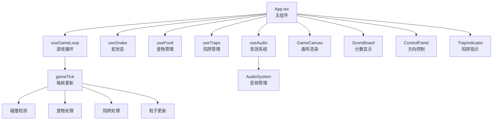
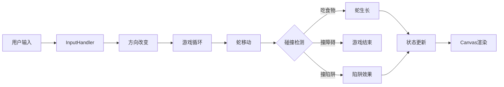

## 产品概述

对现有贪吃蛇游戏进行修复、功能调整和视觉优化，解决食物管理、界面显示、音效问题，并调整游戏平衡性和视觉效果。

## 核心功能

- 修复食物消失问题：确保吃完食物后立即从画面中移除并补充新食物
- 修复界面显示问题：实现游戏画布响应式适配，确保在不同屏幕尺寸下完整显示
- 修复音效系统：添加音效文件并实现音效预加载机制
- 调整金色食物效果：20分、加速6秒、金色粒子效果
- 调整彩虹食物效果：30分、加速+无敌6秒、粉色粒子效果
- 提高陷阱概率：增加陷阱生成频率，提升游戏挑战性
- 优化蛇身视觉效果：增强渐变效果和发光特效
- 优化粒子效果：增加粒子数量和扩散范围
- 优化UI颜色提示：增强食物状态和倍增状态的颜色反馈

## 技术栈

- 前端框架：React 18.3.1 + TypeScript
- 构建工具：Vite 5.2.0
- 样式框架：Tailwind CSS 3.4.17
- 动画库：Framer Motion 11.0.0
- 渲染方式：HTML5 Canvas

## 技术架构

### 系统架构

游戏采用组件化架构，数据流从 App 主组件向下传递至各个子组件。游戏循环通过 useGameLoop hook 驱动，定期触发游戏状态更新。



### 模块划分

- **主应用模块 (App.tsx)**：游戏状态管理、主循环控制、碰撞检测逻辑
- **食物系统 (useFood.ts, Food.ts)**：食物生成、移除、分数计算
- **陷阱系统 (useTraps.ts, Trap.ts)**：陷阱生成、触发、效果应用
- **蛇系统 (useSnake.ts, Snake.ts)**：蛇的移动、生长、状态控制
- **音效系统 (useAudio.ts, AudioSystem.ts)**：音效加载、播放、音量控制
- **渲染模块 (GameCanvas.tsx)**：Canvas 绘制、视觉效果渲染
- **粒子系统 (ParticleSystem.ts)**：粒子生成、更新、移除

### 数据流

用户输入 → InputHandler → 蛇方向更新 → 游戏循环触发 → 蛇移动 → 碰撞检测 → 状态更新 → Canvas 重新渲染



## 实现细节

### 核心目录结构

```
src/
├── App.tsx                      # 修改：修复食物移除逻辑、调整特效时长
├── components/
│   └── GameCanvas.tsx           # 修改：实现响应式画布
├── hooks/
│   ├── useFood.ts               # 修改：优化食物生成和移除
│   └── useAudio.ts              # 修改：添加音效预加载
├── game/
│   ├── AudioSystem.ts           # 修改：改进音效管理
│   └── ParticleSystem.ts        # 修改：优化粒子效果
└── utils/
    └── constants.ts             # 修改：调整食物分数、陷阱概率
```

### 关键代码结构

**食物配置修改**

```typescript
// constants.ts
export const FOOD_SCORES = {
  normal: 10,    // 普通食物
  gold: 20,      // 金色食物：20分（原30）
  rainbow: 30,   // 彩虹食物：30分（原50）
};

// 陷阱概率调整
TRAP_CONFIG: {
  blue: { spawnRate: 0.12 },     // 蓝色陷阱：12%（原8%）
  purple: { spawnRate: 0.08 },   // 紫色陷阱：8%（原5%）
}

// App.tsx 陷阱生成
if (Math.random() < 0.04 && traps.length < 3) {  // 4%（原2%）
  spawnTrap(allOccupied);
}
```

**特效时长调整**

```typescript
// App.tsx
if (eatenFood.type === 'gold') {
  // 金色食物：加速6秒
  setGameState(prev => ({
    ...prev,
    speedMultiplier: 1.5,
    speedMultiplierEndTime: Date.now() + 6000,
  }));
} else if (eatenFood.type === 'rainbow') {
  // 彩虹食物：加速+无敌6秒
  activateInvincibility(6000);
  setGameState(prev => ({
    ...prev,
    speedMultiplier: 1.5,
    speedMultiplierEndTime: Date.now() + 6000,
  }));
  playSound('invincible');
}
```

**响应式画布实现**

```typescript
// GameCanvas.tsx
const canvasRef = useRef<HTMLCanvasElement>(null);
const containerRef = useRef<HTMLDivElement>(null);

useEffect(() => {
  const updateCanvasSize = () => {
    if (containerRef.current && canvasRef.current) {
      const size = Math.min(
        containerRef.current.clientWidth,
        containerRef.current.clientHeight,
        600
      );
      canvasRef.current.width = size;
      canvasRef.current.height = size;
    }
  };
  
  updateCanvasSize();
  window.addEventListener('resize', updateCanvasSize);
  return () => window.removeEventListener('resize', updateCanvasSize);
}, []);
```

**音效预加载**

```typescript
// useAudio.ts
useEffect(() => {
  const audioSystem = new AudioSystem();
  
  // 预加载所有音效
  const loadSounds = async () => {
    await Promise.all([
      loadSound('eat-normal', '/assets/audio/eat-normal.mp3'),
      loadSound('eat-gold', '/assets/audio/eat-gold.mp3'),
      loadSound('eat-rainbow', '/assets/audio/eat-rainbow.mp3'),
      loadSound('invincible', '/assets/audio/invincible.mp3'),
      loadSound('gameover', '/assets/audio/gameover.mp3'),
      loadSound('trap-blue', '/assets/audio/trap-blue.mp3'),
      loadSound('trap-purple', '/assets/audio/trap-purple.mp3'),
    ]);
  };
  
  loadSounds();
}, []);
```

### 技术实现计划

**1. 食物消失修复**

- 问题：App.tsx 中食物移除逻辑存在时序问题
- 解决方案：在 gameTick 中正确调用 useFood hook 的移除逻辑，确保食物状态同步更新
- 实现步骤：修改 App.tsx 第147-183行，优化食物移除和补充机制

**2. 响应式界面适配**

- 问题：固定600x600像素画布导致小屏幕显示不完整
- 解决方案：动态计算画布尺寸，使用容器宽度限制
- 实现步骤：添加容器引用、监听窗口resize事件、动态调整canvas尺寸

**3. 音效系统修复**

- 问题：缺少音效文件且未预加载
- 解决方案：添加占位音效文件、实现预加载机制、使用Web Audio API合成音效
- 实现步骤：创建占位音效文件、修改AudioSystem支持合成音效、在useAudio中预加载

**4. 游戏平衡调整**

- 问题：金色/彩虹食物效果不符合需求、陷阱概率过低
- 解决方案：调整constants.ts配置、修改App.tsx特效逻辑
- 实现步骤：修改FOOD_SCORES、调整TRAP_CONFIG概率、修改gameTick中的特效处理

**5. 视觉效果优化**

- 问题：蛇身效果普通、粒子效果不够明显、UI反馈不足
- 解决方案：增强渐变效果、增加发光特效、优化粒子数量和颜色、改进UI颜色提示
- 实现步骤：优化GameCanvas绘制逻辑、增强ParticleSystem效果、添加状态颜色反馈

### 集成点

- App.tsx 与各 hook 的状态同步
- GameCanvas 与游戏状态的实时渲染
- AudioSystem 与游戏事件的音效触发
- ParticleSystem 与游戏事件的粒子效果关联

## 技术考量

### 日志

- 在关键事件处添加 console.log（食物生成、陷阱触发、特效激活等）
- 便于调试和问题追踪

### 性能优化

- 使用 requestAnimationFrame 优化渲染性能
- 粒子系统限制最大数量，避免性能问题
- Canvas 绘制使用批量操作减少重绘

### 安全措施

- 音效加载失败时的降级处理（使用合成音效）
- 画布尺寸计算的安全边界检查
- 防止无限循环的随机位置生成逻辑

### 可扩展性

- 常量配置集中管理，便于调整游戏参数
- 组件化设计，便于添加新功能
- Hook 抽象，便于复用逻辑

## Agent Extensions

本次计划不涉及使用任何 Agent Extensions，所有修改将通过直接代码实现完成。