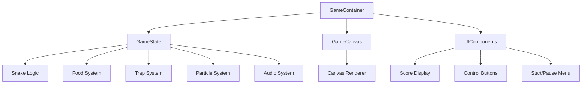

## 产品概述

一个功能完整的React贪吃蛇游戏，包含多种食物类型、陷阱机制、粒子特效和完整的音效系统，支持桌面端和移动端双平台。

## 核心功能

- PRD文档保存至项目根目录
- 蛇身移动与控制（键盘方向键、WASD、移动端滑动）
- 三种食物类型：普通食物(绿色，80%)、金色食物(黄色，15%高分)、彩虹食物(彩虹色，5%特殊效果)
- 两种陷阱系统：蓝色陷阱(锁定方向1秒，15秒存续期，8%刷新率)、紫色陷阱(断尾变障碍，20秒存续期，5%刷新率)
- 粒子特效系统：吃食物、死亡、撞击时的粒子动画
- 音频系统：背景音乐和游戏音效
- 游戏循环控制：开始、暂停、重置
- 响应式设计：600×600画布自适应不同屏幕
- 阶梯式加速机制：蛇身长度增加时游戏速度提升

## 技术栈

- 前端框架：React 18 + TypeScript
- 构建工具：Vite
- 渲染引擎：Canvas API
- 动画库：Framer Motion
- 样式方案：styled-components
- 状态管理：React Hooks (useState, useRef, useEffect, useCallback)
- 音频系统：Web Audio API

## 技术架构

### 系统架构



### 模块划分

- **GameState Module**: 管理游戏全局状态（分数、速度、游戏状态等）
- **Snake Module**: 处理蛇的移动、增长、碰撞检测
- **Food Module**: 管理食物生成、类型概率、特殊效果
- **Trap Module**: 控制陷阱生成、定时销毁、效果触发
- **Particle Module**: 粒子系统，处理粒子生命周期和渲染
- **Audio Module**: 管理BGM播放和音效触发
- **Renderer Module**: Canvas绘制逻辑
- **InputHandler Module**: 统一处理键盘和触摸输入

### 数据流

用户输入 → InputHandler验证 → Snake状态更新 → 碰撞检测 → 食物/陷阱/墙壁判断 → 粒子/音效触发 → Canvas重绘 → UI更新

## 实现细节

### 核心目录结构

```
greedy-snake/
├── public/
│   ├── assets/
│   │   ├── audio/
│   │   │   ├── bgm.mp3
│   │   │   ├── eat.mp3
│   │   │   ├── trap.mp3
│   │   │   └── gameover.mp3
│   │   └── images/
│   └── index.html
├── src/
│   ├── components/
│   │   ├── GameCanvas.tsx
│   │   ├── ScoreBoard.tsx
│   │   ├── ControlPanel.tsx
│   │   └── StartMenu.tsx
│   ├── game/
│   │   ├── GameState.ts
│   │   ├── Snake.ts
│   │   ├── Food.ts
│   │   ├── Trap.ts
│   │   ├── ParticleSystem.ts
│   │   ├── AudioSystem.ts
│   │   └── InputHandler.ts
│   ├── utils/
│   │   ├── constants.ts
│   │   ├── helpers.ts
│   │   └── types.ts
│   ├── App.tsx
│   └── main.tsx
├── package.json
├── vite.config.ts
├── tsconfig.json
└── PRD.md
```

### 关键代码结构

**游戏配置常量**

```typescript
interface GameConfig {
  CANVAS_SIZE: 600;
  GRID_SIZE: 30;
  CELL_SIZE: number;
  INITIAL_SPEED: 200;
  FOOD_PROBABILITY: { normal: 0.8, gold: 0.15, rainbow: 0.05 };
  TRAP_CONFIG: {
    blue: { duration: 15000, spawnRate: 0.08, lockTime: 1000 };
    purple: { duration: 20000, spawnRate: 0.05 }
  };
}
```

**蛇数据结构**

```typescript
interface Snake {
  body: Position[];
  direction: Direction;
  nextDirection: Direction;
  isLocked: boolean;
  lockEndTime: number;
}
```

**食物类型**

```typescript
type FoodType = 'normal' | 'gold' | 'rainbow';

interface Food {
  position: Position;
  type: FoodType;
}
```

**粒子系统**

```typescript
interface Particle {
  x: number;
  y: number;
  vx: number;
  vy: number;
  color: string;
  life: number;
  maxLife: number;
}
```

### 技术实现计划

1. **项目初始化**

- 使用Vite创建React+TypeScript项目
- 安装依赖：framer-motion, styled-components
- 配置项目结构和常量

2. **核心游戏循环**

- 使用useRef存储游戏状态避免重渲染
- 使用requestAnimationFrame实现平滑动画
- 实现基于时间的游戏速度控制

3. **Canvas渲染系统**

- 设计高效的重绘策略
- 实现网格、蛇、食物、陷阱、粒子的绘制
- 优化渲染性能

4. **碰撞检测系统**

- 蛇头与身体碰撞检测
- 蛇头与食物碰撞
- 蛇头与陷阱碰撞
- 蛇头与墙壁碰撞

5. **粒子特效**

- 使用Framer Motion或Canvas实现粒子动画
- 设计不同事件的粒子效果
- 优化粒子数量和性能

6. **音频系统**

- 使用Web Audio API实现BGM循环
- 预加载音效资源
- 实现音量控制和静音功能

7. **响应式设计**

- Canvas自适应屏幕大小
- 触摸滑动控制实现
- 移动端UI优化

### 集成点

- **Canvas API**: 主要渲染引擎
- **React Hooks**: 状态管理和生命周期控制
- **styled-components**: UI组件样式封装
- **Framer Motion**: UI动画和过渡效果
- **Web Audio API**: 音频播放控制

## 技术考量

### 性能优化

- 使用useCallback和useMemo优化组件渲染
- Canvas离屏渲染优化
- 粒子系统使用对象池减少GC
- 游戏循环使用时间增量确保不同帧率下速度一致

### 安全性

- 输入验证防止非法方向切换
- 边界检查防止数组越界
- 音频资源加载失败处理

### 可扩展性

- 模块化设计便于添加新食物/陷阱类型
- 配置化系统便于调整游戏参数
- 插件式粒子效果系统

## 设计风格

采用现代简约风格结合游戏化元素。使用Material Design 3规范，结合高对比度配色方案确保游戏元素清晰可见。

## 页面规划

### 主游戏页面 (GamePage)

1. **顶部导航栏**: 游戏标题、当前分数、最高分、音量控制按钮
2. **游戏画布区域**: 600×600像素的Canvas，居中显示，自适应屏幕
3. **控制面板**: 移动端显示虚拟方向键，桌面端显示操作提示
4. **游戏状态浮层**: 开始菜单、暂停菜单、游戏结束结算面板

### 设计细节

**色彩系统**:

- 背景：深色渐变(#1a1a2e到#16213e)减少眼睛疲劳
- 蛇身：渐变绿色(#4ade80到#22c55e)
- 普通食物：亮绿色(#00ff88)带发光效果
- 金色食物：金黄色(#ffd700)带金色光环
- 彩虹食物：彩虹渐变色
- 蓝色陷阱：半透明蓝色(#3b82f6)带锁图标
- 紫色陷阱：半透明紫色(#8b5cf6)带警告图标
- 粒子效果：根据触发事件动态变化颜色

**视觉特效**:

- 食物发光脉冲动画
- 蛇身移动时的微光拖尾
- 吃食物时的粒子爆炸效果
- 陷阱出现时的淡入动画
- 死亡时的屏幕震动效果
- UI元素的悬停和点击反馈

**布局设计**:

- 响应式Flexbox布局
- Canvas保持1:1比例，最大600px
- 移动端优先控制按钮易点击性(最小44px)
- 信息层级清晰，分数、状态一目了然

**交互动画**:

- 按钮悬停放大和颜色变化
- 菜单淡入淡出
- 分数更新时的数字滚动
- 方向键按下时的缩放反馈

## Agent Extensions

### MCP

- **GitHub MCP Server**
- Purpose: 创建GitHub仓库并保存PRD文档和项目代码
- Expected outcome: 创建远程仓库，PRD文档和完整游戏代码已提交到仓库